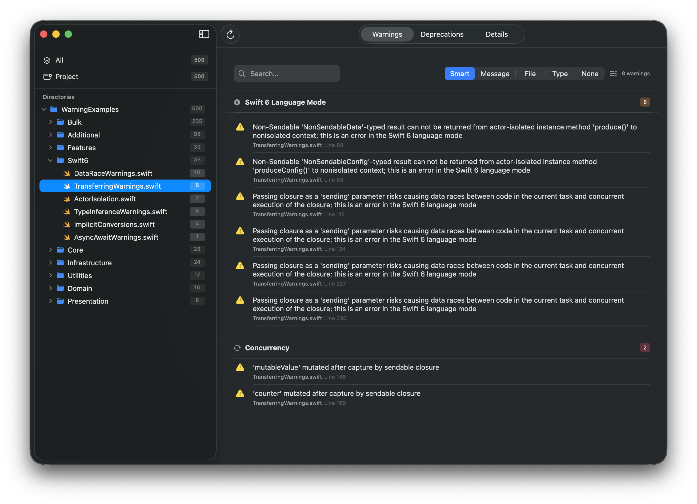
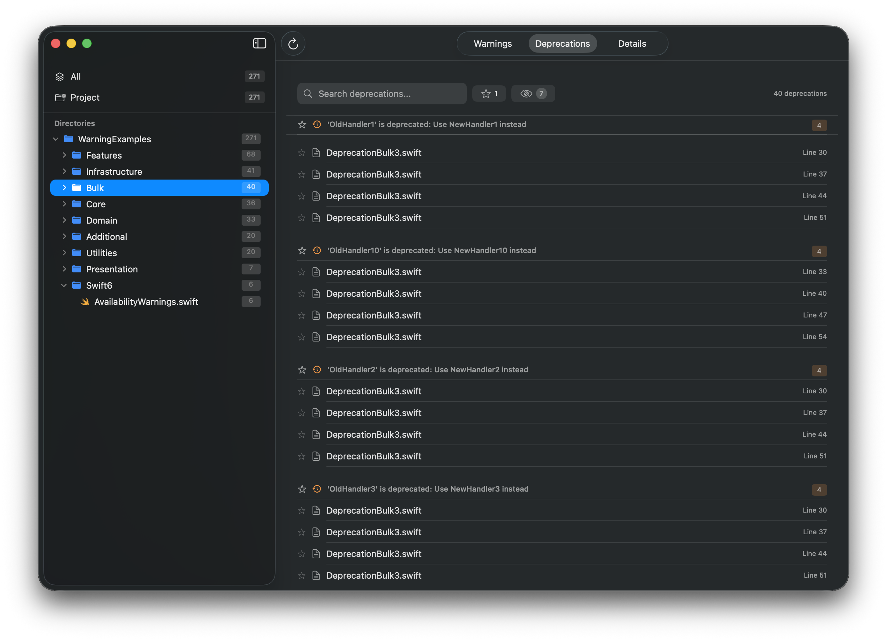

<div align="center">
  

  # BuildSignal

  A macOS developer tool for analyzing and managing Xcode build warnings and deprecations.
</div>

## Installation

### Homebrew (Recommended)

```bash
brew install hi2gage/hi2gage/buildsignal
```

### Manual Download

Download the latest release from [GitHub Releases](https://github.com/hi2gage/BuildSignal/releases)

## Features

- 📊 **Visual Build Analysis** - Parse Xcode build logs and visualize warnings
- 🔍 **Smart Filtering** - Filter warnings by category, file, or scope
- ⚠️ **Deprecation Tracking** - Track and manage deprecated API usage
- 📁 **Project Organization** - Browse warnings by directory structure
- ⭐ **Favorites & Hidden** - Mark important warnings or hide resolved issues
- 🎯 **Category Management** - Create custom warning categories with regex patterns

## Screenshots



*Organize and filter Swift 6 concurrency warnings by directory and file*



*Track deprecated API usage across your codebase*

## Usage

1. **Build your project in Xcode** - Perform a full build to generate build logs in DerivedData
2. **Open BuildSignal**
3. **Browse DerivedData** to automatically detect recent builds, or drag a build log JSON file
4. **Analyze warnings** by category, file, or custom filters
5. **Manage technical debt** by favoriting or hiding issues

## Requirements

- macOS 15.0 or later
- Xcode (for build log generation)

## Development

Built with [XCLogParser](https://github.com/MobileNativeFoundation/XCLogParser) for parsing Xcode build logs.

### Building from Source

```bash
git clone https://github.com/hi2gage/BuildSignal.git
cd BuildSignal
open BuildSignal.xcodeproj
```

Configuration uses `.xcconfig` files. Copy `Config/Secrets.xcconfig.template` to `Config/Secrets.xcconfig` and add your Team ID.

## License

MIT License - see [LICENSE](LICENSE) for details

## Author

Gage Halverson ([@hi2gage](https://github.com/hi2gage))
